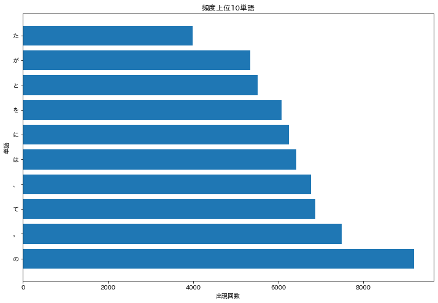
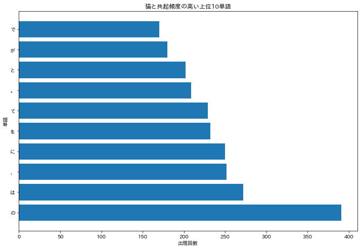
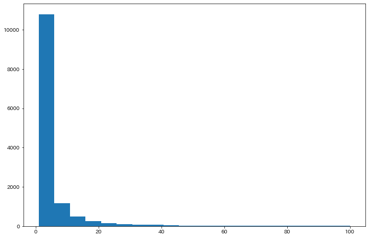
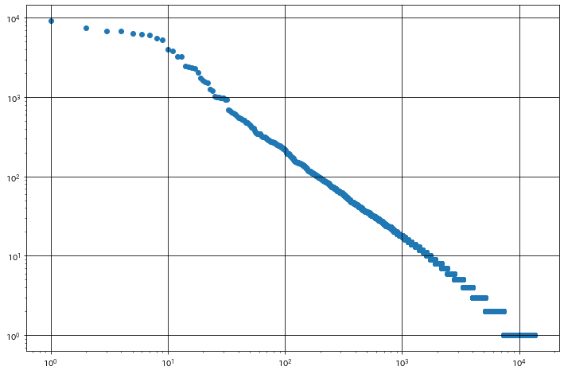

# 言語処理100本ノック 2020年

[言語処理100本ノック2020版](https://nlp100.github.io/ja/)が公開されたのでこの機会に解いていく。
GitHubに公開しているJupyterをmarkdown出力したものなので，一度読み込んだパッケージはその後に読み込んでいないことに注意。

## 第4章: 形態素解析

> 夏目漱石の小説『吾輩は猫である』の文章（[neko.txt](https://nlp100.github.io/data/neko.txt)）をMeCabを使って形態素解析し，その結果をneko.txt.mecabというファイルに保存せよ．このファイルを用いて，以下の問に対応するプログラムを実装せよ．
なお，問題37, 38, 39はmatplotlibもしくは[Gnuplot](http://www.gnuplot.info/)を用いるとよい．

形態素解析とは[Wikipedia](https://ja.wikipedia.org/wiki/%E5%BD%A2%E6%85%8B%E7%B4%A0%E8%A7%A3%E6%9E%90)より，

> 形態素解析（けいたいそかいせき、Morphological Analysis）とは、文法的な情報の注記の無い自然言語のテキストデータ（文）から、対象言語の文法や、辞書と呼ばれる単語の品詞等の情報にもとづき、形態素（Morpheme, おおまかにいえば、言語で意味を持つ最小単位）の列に分割し、それぞれの形態素の品詞等を判別する作業である。

### 前処理

問題を解き始める前に，`matplotlib`のimportと，MeCabによる形態素解析まで行っておく。MeCabは`Homebrew`でインストールしたものを使用している。

```sh
mecab < ../data/neko.txt > ../data/neko.txt.mecab
```


```python
import matplotlib.pyplot as plt
```

### 30. 形態素解析結果の読み込み

> 形態素解析結果（neko.txt.mecab）を読み込むプログラムを実装せよ．ただし，各形態素は表層形（surface），基本形（base），品詞（pos），品詞細分類1（pos1）をキーとするマッピング型に格納し，1文を形態素（マッピング型）のリストとして表現せよ．第4章の残りの問題では，ここで作ったプログラムを活用せよ．

各形態素が格納されるマッピング型は`{'surface': 'で', 'base': 'だ', 'pos': '助動詞', 'pos1': '*'}`のような形。


```python
fname = '../data/neko.txt.mecab'

def read_mecab(fname):
    with open(fname, mode='rt', encoding='utf-8') as f:
        # EOS除去除去しながら，一文ずつリスト収納
        sentence_list = f.read().split('EOS\n')
        sentence_list = list(filter(lambda x: x != '', sentence_list))
    result_list = []
    for sentence in sentence_list:
        morpheme_list = []
        for word in sentence.split('\n'):
            if word != '':
                (surface, attr) = word.split('\t')
                attr = attr.split(',')
                component_dict = {
                    'surface': surface,
                    'base': attr[6],
                    'pos': attr[0],
                    'pos1': attr[1]
                }
                morpheme_list.append(component_dict)
        result_list.append(morpheme_list)
    return result_list

neko_morpheme = read_mecab(fname)
print(neko_morpheme[:4])
```

    [[{'surface': '一', 'base': '一', 'pos': '名詞', 'pos1': '数'}], [{'surface': '\u3000', 'base': '\u3000', 'pos': '記号', 'pos1': '空白'}, {'surface': '吾輩', 'base': '吾輩', 'pos': '名詞', 'pos1': '代名詞'}, {'surface': 'は', 'base': 'は', 'pos': '助詞', 'pos1': '係助詞'}, {'surface': '猫', 'base': '猫', 'pos': '名詞', 'pos1': '一般'}, {'surface': 'で', 'base': 'だ', 'pos': '助動詞', 'pos1': '*'}, {'surface': 'ある', 'base': 'ある', 'pos': '助動詞', 'pos1': '*'}, {'surface': '。', 'base': '。', 'pos': '記号', 'pos1': '句点'}], [{'surface': '名前', 'base': '名前', 'pos': '名詞', 'pos1': '一般'}, {'surface': 'は', 'base': 'は', 'pos': '助詞', 'pos1': '係助詞'}, {'surface': 'まだ', 'base': 'まだ', 'pos': '副詞', 'pos1': '助詞類接続'}, {'surface': '無い', 'base': '無い', 'pos': '形容詞', 'pos1': '自立'}, {'surface': '。', 'base': '。', 'pos': '記号', 'pos1': '句点'}], [{'surface': '\u3000', 'base': '\u3000', 'pos': '記号', 'pos1': '空白'}, {'surface': 'どこ', 'base': 'どこ', 'pos': '名詞', 'pos1': '代名詞'}, {'surface': 'で', 'base': 'で', 'pos': '助詞', 'pos1': '格助詞'}, {'surface': '生れ', 'base': '生れる', 'pos': '動詞', 'pos1': '自立'}, {'surface': 'た', 'base': 'た', 'pos': '助動詞', 'pos1': '*'}, {'surface': 'か', 'base': 'か', 'pos': '助詞', 'pos1': '副助詞／並立助詞／終助詞'}, {'surface': 'とんと', 'base': 'とんと', 'pos': '副詞', 'pos1': '一般'}, {'surface': '見当', 'base': '見当', 'pos': '名詞', 'pos1': 'サ変接続'}, {'surface': 'が', 'base': 'が', 'pos': '助詞', 'pos1': '格助詞'}, {'surface': 'つか', 'base': 'つく', 'pos': '動詞', 'pos1': '自立'}, {'surface': 'ぬ', 'base': 'ぬ', 'pos': '助動詞', 'pos1': '*'}, {'surface': '。', 'base': '。', 'pos': '記号', 'pos1': '句点'}]]


### 31. 動詞

> 動詞の表層系をすべて抽出せよ.

posが動詞のsurfaceを抽出する。とりあえず，動詞を抽出すれば良いだけなので一度文章ごとのリストを平坦化して処理した。
出力はリストにしたが，重複した要素がいらないならsetにすれば良い。`set(verbose_list)`するだけ。


```python
from itertools import chain

def extract_verbose(target):
    flatten_list = list(chain.from_iterable(target))
    return [word['surface'] for word in flatten_list if word['pos'] == '動詞']
    
verbose_list = extract_verbose(neko_morpheme)
print(verbose_list[:10])
```

    ['生れ', 'つか', 'し', '泣い', 'し', 'いる', '始め', '見', '聞く', '捕え']


### 32. 動詞の原型

> 動詞の原形をすべて抽出せよ


```python
def extract_verb_base(target):
    flatten_list = list(chain.from_iterable(target))
    return [word['base'] for word in flatten_list if word['pos'] == '動詞']

verb_base_list = extract_verb_base(neko_morpheme)
print(verb_base_list[:10])
```

    ['生れる', 'つく', 'する', '泣く', 'する', 'いる', '始める', '見る', '聞く', '捕える']


### 33. 「AのB」

> 2つの名詞が「の」で連結されている名詞句を抽出せよ．

文章ごとに処理しないといけない。連結されている名詞句を{A:B}という形の辞書としてリストに追加していく。


```python
def extract_connected_by_of(target):
    result_list = []
    for dict in target:
        for i in range(1, len(dict)-1):
            if dict[i-1]['pos'] == '名詞' and dict[i]['base'] == 'の' and dict[i+1]['pos'] == '名詞':
                result_list.append({dict[i-1]['surface']: dict[i+1]['surface']})
    return result_list

a_of_b_list = extract_connected_by_of(neko_morpheme)
print(a_of_b_list[:10])
```

    [{'彼': '掌'}, {'掌': '上'}, {'書生': '顔'}, {'はず': '顔'}, {'顔': '真中'}, {'穴': '中'}, {'書生': '掌'}, {'掌': '裏'}, {'何': '事'}, {'肝心': '母親'}]


### 34. 名詞の連接 

> 名詞の連接（連続して出現する名詞）を最長一致で抽出せよ．

名詞が繋がっている限り，全ての名詞を結果に加えないといけない。


```python
def extract_chain_noun(target_list):
    result_list = []
    temp_list = []
    for d in target_list:
        for word in d:  
            if word['pos'] == '名詞':
                temp_list.append(word['surface'])
            elif len(temp_list) > 1 :
                result_list.append(temp_list)
                temp_list = []
            else:
                temp_list = []
    return result_list

chain_noun_list = extract_chain_noun(neko_morpheme)

for i in chain_noun_list[:10]:
    print(i)
```

    ['人間', '中']
    ['一番', '獰悪']
    ['時', '妙']
    ['一', '毛']
    ['その後', '猫']
    ['一', '度']
    ['ぷうぷうと', '煙']
    ['邸', '内']
    ['三', '毛']
    ['書生', '以外']


### 35. 単語の出現頻度

> 文章中に出現する単語とその出現頻度を求め，出現頻度の高い順に並べよ

Pythonの標準ライブラリの`collections`の`Counter`を用い，単語と出現回数のタプルが収納されたリストを取得する。


```python
#from itertools import chain
from collections import Counter

def extract_word_frequency(target):
    flatten_list = list(chain.from_iterable(target))
    word_list = [word['surface'] for word in flatten_list]
    counted_list = Counter(word_list).most_common()
    return counted_list

word_counted_list = extract_word_frequency(neko_morpheme)
word, counts = zip(*word_counted_list)
print(word[:20])
```

    ('の', '。', 'て', '、', 'は', 'に', 'を', 'と', 'が', 'た', 'で', '「', '」', 'も', 'ない', 'だ', 'し', 'から', 'ある', 'な')


### 36. 頻度上位10語

> 出現頻度が高い10語とその出現頻度をグラフ（例えば棒グラフなど）で表示せよ．


```python
# import matplotlib.pyplot as plt
import japanize_matplotlib

plt.figure(figsize=(12, 8))
plt.barh(word[:10], counts[:10])
plt.title('頻度上位10単語')
plt.xlabel('出現回数')
plt.ylabel('単語')
plt.show()
```





### 37.「猫」と共起頻度の高い上位10語

> 「猫」とよく共起する（共起頻度が高い）10語とその出現頻度をグラフ（例えば棒グラフなど）で表示せよ．

まず，共起頻度をどう定義するかを考えないといけないが，ここでは同じ文章中に出現している単語を抽出することと解釈して行った。

* 猫を含む行を抽出→猫以外の単語をリストに収納する関数を定義。
* リストから要素の出現頻度を算出する関数の定義。
* プロット

という3手順でおこなう。


```python
def extract_cooccurrence_list(target):
    cooccurrence_list = []
    for sentence in target:
        # surfaceに猫が含まれていたらlistに追加する。
        word_list = [word['surface'] for word in sentence]
        if "猫" in word_list:
            cooccurrence_list.extend([word for word in word_list if word != "猫"])
    return cooccurrence_list

def caluculate_word_frequence(target):
    counted_list = Counter(target).most_common()
    word, counts = zip(*counted_list)
    return word, counts


def main():
    cat_frequence_list = extract_cooccurrence_list(neko_morpheme)
    neko_word, neko_count = caluculate_word_frequence(cat_frequence_list)
    plt.figure(figsize=(12, 8))
    plt.barh(neko_word[:10], neko_count[:10])
    plt.title('猫と共起頻度の高い上位10単語')
    plt.xlabel('出現回数')
    plt.ylabel('単語')
    plt.show()

if __name__ == '__main__':
    main()
```





### 38. ヒストグラム 

> 単語の出現頻度のヒストグラム（横軸に出現頻度，縦軸に出現頻度をとる単語の種類数を棒グラフで表したもの）を描け．

35で算出したcountsリストを用いる。このように後から参照するならもう少しいい名前をつけるべき。
今回は出現頻度100までをプロットした。


```python
plt.figure(figsize = (12,8))
plt.hist(counts, bins=20, range=(1,100))
plt.show()
```





### 39.Zipfの法則

> 単語の出現頻度順位を横軸，その出現頻度を縦軸として，両対数グラフをプロットせよ．

35で取得したcountsリストは，順位順に並んでいる。


```python
# 出現順位のリストを作成
rank_list = [i+1 for i in range(len(counts))]

plt.figure(figsize = (12,8))
plt.scatter(rank_list, counts)
plt.xscale('log')
plt.yscale('log')
plt.grid(which='major',color='black')

plt.show()
```




